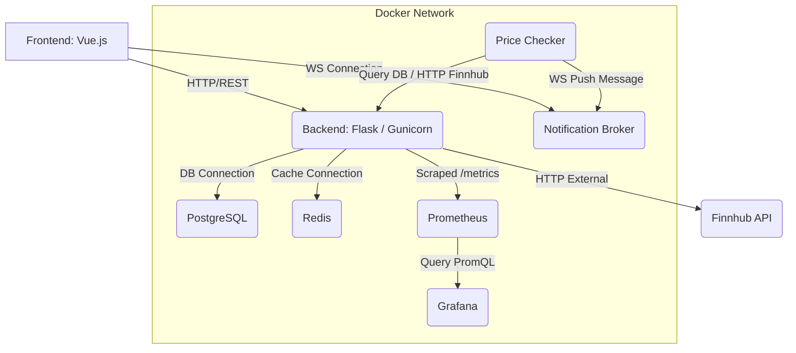

## Investment Portfolio Tracker (Vue.js + Flask Full-Stack)

A modern, containerized Full-Stack application designed to track user investment portfolios, providing real-time valuation of holdings through external market APIs.

### Key Features

* **Secure Authentication (JWT):** Users can register and log in via a secure JSON Web Token (JWT) system.
* **Portfolio Management:** Users can create, view, and delete investment portfolios and individual stock holdings.
* **Real-Time Stock Valuation:** Fetching current stock prices (e.g., AAPL, NVDA) via the **Finnhub API** to calculate market value and realized profit/loss.
* **Live Notifications (WebSockets):** Implemented an asynchronous **Notification Broker** and **Price Checker** for real-time status updates and price change alerts.
* **Observability:** Integrated **Prometheus** for performance metrics collection and **Grafana** for custom dashboard visualization (tracking API latency, login failures, etc.). 
* **Caching Layer:** **Redis** is implemented as a fast in-memory cache for storing static data (e.g., company logos) to minimize external API calls and latency.

### ⚙️ Microservices Architecture & Container Flow

The application is deployed using **Docker Compose**, where each component (DB, Cache, API) is an isolated service, following a microservices approach.



---

### Installation & Local Run

1.  **Clone the repository and install dependencies:**
    ```bash
    git clone [REPO_URL]
    cd vue-flask-portfolio
    # Ensure Docker Desktop is running!
    ```

2.  **Configure Environment:**
    * Update `docker-compose.yml` with correct secrets/API keys (or use a local `.env` file if configured).

3.  **Start Services (Backend, DB, Monitoring):**
    ```bash
    # Starts all services, including Postgres, Redis, Prometheus, and Grafana
    docker compose up -d --build
    ```

4.  **Run Migrations (Create Tables):**
    * Activate your local Python environment (`venv`).
    * Migrate the local database schema:
    ```bash
    # (Activate venv first)
    flask db upgrade
    ```

5.  **Run Frontend (Development):**
    ```bash
    cd frontend
    npm install
    npm run dev
    # Access the app at http://localhost:5173/
    ```
    (Access Grafana at http://localhost:3000 to see metrics!)
